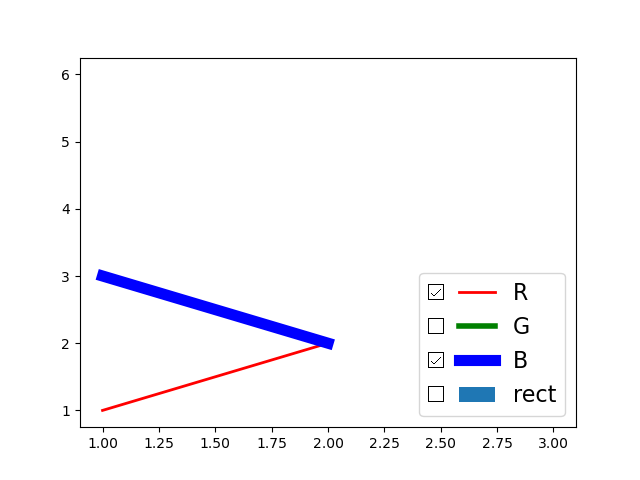
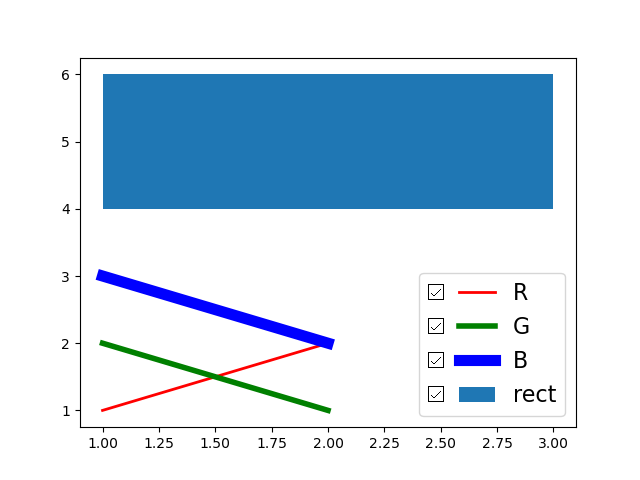

# Matplotlib: legend addon to control subplot visibility

This feature adds checkboxes corresponding to the visibility of subplots.\
An example is given below, view the user guide in P4_Integration_and_System_Testing for further details.

